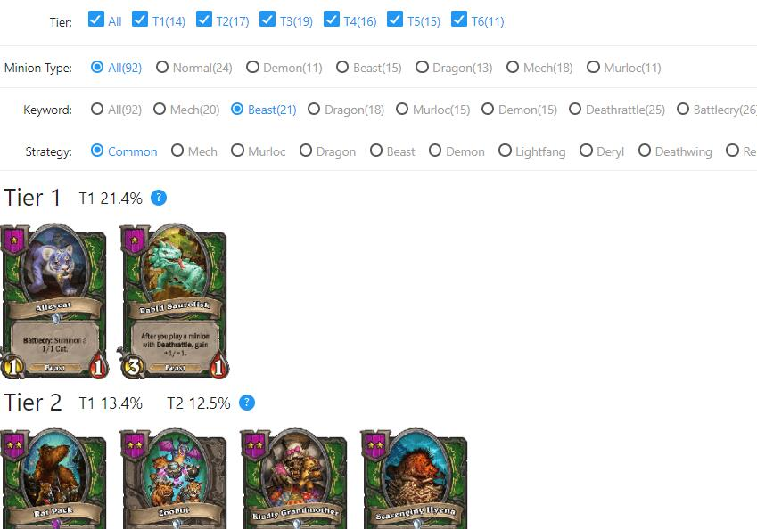
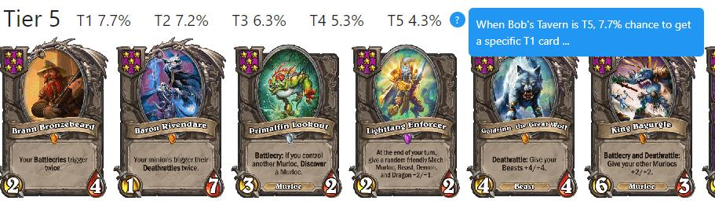

# [HearthStone V18.4 Battlegrounds Card Picker(炉石传说酒馆战棋选牌器)](http://www.chixu.info/p/hsbg/)

HearthStone Battlegrounds Card Picker helps you to make better decision for card picking during HearthStone Battlegrounds

## [Live Demo](http://www.chixu.info/hsbg/)

## Features
- Fast loading (compressed card images)
- Filters:
  - **Minion Type**: e.g. When you want to find all the `Beast` cards
  - **Keyword**: e.g. When you want to find all the `Battlecry` cards
  - **Strategy**: e.g. When you play `Deathwing`, the app shows you the cards to pick sorted by priorities. (More strategies will be added)
- The probability to pick a certain card

&nbsp;&nbsp;&nbsp;As the image shows, when your tavern is Tier 5, the probability to pick a certain Tier 5 card (e.g. Brann) is 4.3%, Tier 4 is 5.3% and so on.

&nbsp;&nbsp;&nbsp;Total card in Tier 5 = 16x14 + 15x17 + 13x19 + 11x16 + 9x15 = 1037

&nbsp;&nbsp;&nbsp;Tier 5 has 5 cards to choose

&nbsp;&nbsp;&nbsp;Therefore, the probability = 5 * 9 / 1037 = 4.3%

&nbsp;&nbsp;&nbsp;**Assumption**: all the cards are in the pool

| Tavern Tier        | Copies of each card          | Number of Cards  |
|:-------------:|:-------------:|:-----:|
| 1      | 16         | 14 |
| 2      | 15      |   17 |
| 3      | 13     |    19 |
| 4      | 11     |    16 |
| 5     | 9     |    15 |
| 6      | 7     |    11 |

&nbsp;&nbsp;&nbsp;**Notice**: The example given and data is from Version `17.2`

&nbsp;&nbsp;&nbsp;[Reference: https://hearthstone.gamepedia.com/Battlegrounds](https://hearthstone.gamepedia.com/Battlegrounds)

## Steps
- get [data.json](https://playhearthstone.com/en-us/battlegrounds?type=hero%2Cminion&tier=1%2C2%2C3%2C4%2C5%2C6&viewMode=grid&collectible=0%2C1)
- get [data_cn.json](https://hs.blizzard.cn/cards/battlegrounds?type=minion&tier=1%2C2%2C3%2C4%2C5%2C6&viewMode=grid&collectible=0%2C1)
- py main.py
- py minionpool.py

